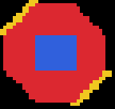
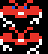
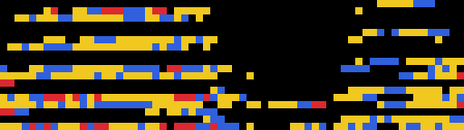
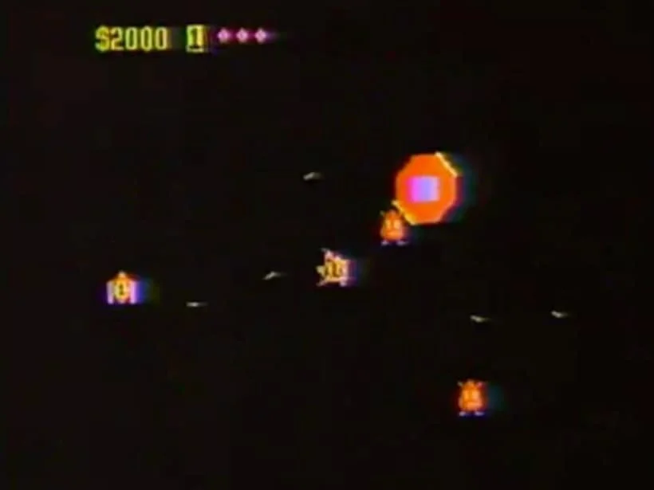
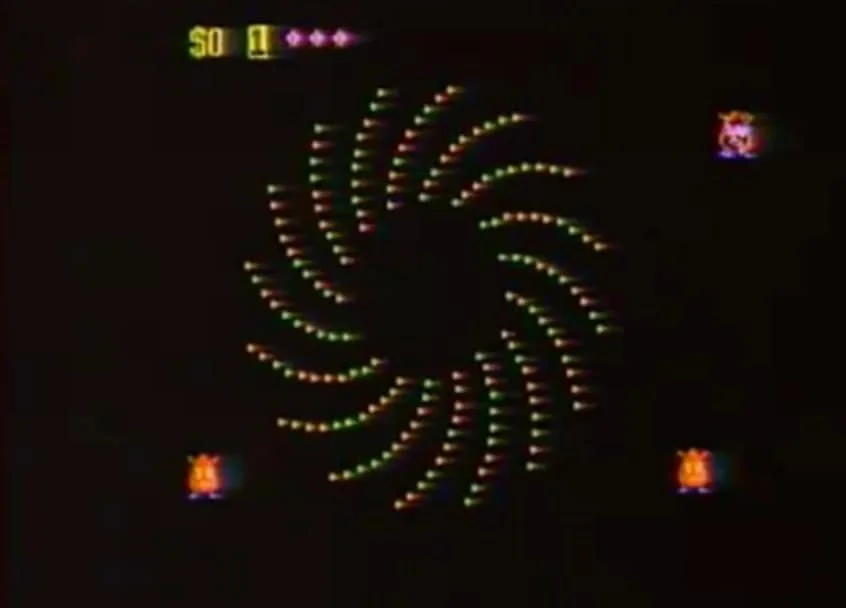
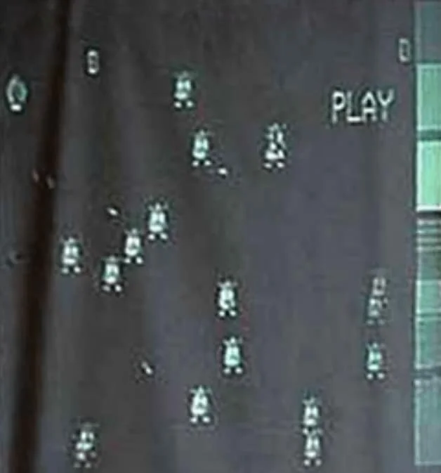
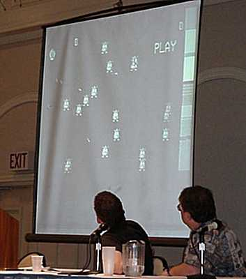
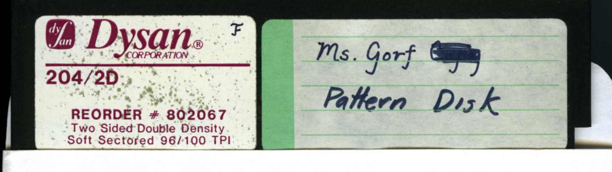
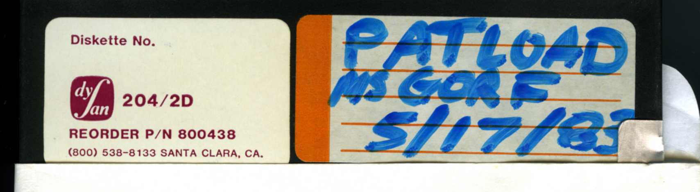
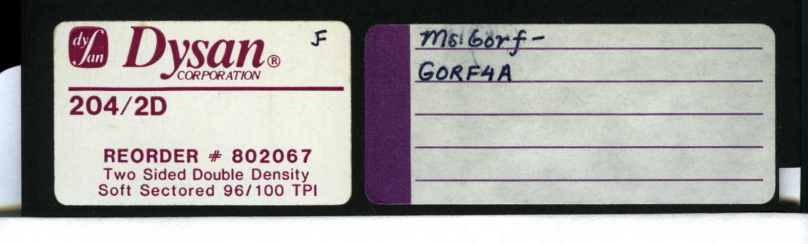

# Ms. Gorf research lab

Unfinished Midway / Dave Nutting Associates arcade sequel to **Gorf** (Jamie Fenton, ~1982–83), written in **Nutting TERSE**. This repo is a **source-faithful** recovery lab: extract what is on the floppies, build toolchain toward a compiled ROM, and **not** invent a fake game.

| Goal | Status |
|------|--------|
| **Primary:** compiled arcade ROM (or closest faithful binary) | **Blocked** — application TERSE / `XC.LOGIC` not in public dumps |
| Pattern art + `XC.PATTERNS` decode | **Done** |
| Browser pattern lab (`play/`) | **Done** — browse-only, no invented gameplay |
| Python TERSE parse → host IR → C/SDL validator | **Runnable** for patterns / blit / collision ABI |
| Full playable Ms. Gorf | Needs missing media (see below) |

**Faithfulness rule:** if it is not on the disks (or a clearly labeled reconstruction), it does not go in `play/` or pretend to be the arcade game.

---

## What we need (blocker)

Public Bitsavers images are the **pattern toolchain** only. Jamie’s **application program** and/or the cross-compiled object **`XC.LOGIC`** are **not** in this tree.

| Missing | Why it matters |
|---------|----------------|
| Application TERSE screens (“Jay’s program”) | Missions, sticks, real game loop |
| `XC.LOGIC` (and likely `XC.VIDEO`) | Binary artists `BINLOAD` / `LLOAD` into the IceBox |
| Likely **8″** disks (historically cited; labels like “RIP Ms. Gorf…”) | Not the three 5¼″ Dysan pattern disks we have |

Full write-up: [`docs/findings/missing-files-hunt.md`](docs/findings/missing-files-hunt.md) · outreach drafts: [`docs/findings/missing-files-outreach.md`](docs/findings/missing-files-outreach.md)

Contact path for existing workers: [Matthew Garrett — GORF page](https://www.professionalmagic.com/gorf) (`info@professionalmagic.com`).

---

## Progress snapshot

| Area | Status | Where |
|------|--------|-------|
| Disk inventory + polarity normalize | Done | [`docs/inventory/disks.md`](docs/inventory/disks.md), `work/*.img.corrected` |
| Tim’s per-file extract | Done | `extracted/msgorf_floppy_files/` |
| Pattern PNGs from source | Done | [`extracted/patterns/`](extracted/patterns/) (see gallery below) |
| Web pattern lab | Done | [`play/index.html`](play/index.html) + `play/assets.json` |
| `XC.PATTERNS` @ `ROMSTART` | Done | [`out/msgorf_patterns_at_4000.bin`](out/msgorf_patterns_at_4000.bin) |
| Simple XC pattern decode | Done | [`docs/findings/xc-patterns-format.md`](docs/findings/xc-patterns-format.md) |
| Host IR + BULLETS stubs | Done | `python3 -m tools.terse.compile_host --bullets` |
| SDL2 pattern validator | Done | `make -C tools/terse/runtime run` (**not** a game) |
| Jamie TERSE/Ice manuals | Mirrored | [`docs/references/jamie_fenton_via_garrett/`](docs/references/jamie_fenton_via_garrett/) |
| Game logic / `XC.LOGIC` | **Missing** | [`docs/findings/xc-logic.md`](docs/findings/xc-logic.md) |

Docs map: [`docs/README.md`](docs/README.md)

---

## Quick start

```bash
# Needs: Python 3; for SDL validator also `brew install sdl2`

# Corrected images (if regenerating)
python3 tools/normalize_img.py

# Pattern lab (browse-only)
python3 tools/export_play_assets.py
open play/index.html          # or any static file server
# Cycles CLONE / KAMI / SMINE / BANG frames; shared BYBR palette

# SDL atlas of animated patterns (validator, not gameplay)
make -C tools/terse/runtime run

# Host IR + tests
python3 -m tools.terse.compile_host --bullets
python3 -m unittest tools.terse.test_compile_host
```

Toolchain notes: [`docs/architecture/terse-toolchain.md`](docs/architecture/terse-toolchain.md)

---

## Gallery — extracted graphics

Authentic 2bpp patterns from the TERSE sources. Lab palette hypothesis: **0** black · **1** yellow · **2** blue · **3** red (same for all). Full set under [`extracted/patterns/`](extracted/patterns/); animate in [`play/index.html`](play/index.html).

### Ships & figures

| GORF-PAT | PLY1-P | PLY2-P | LAZON | P1UP / P2UP |
|:--:|:--:|:--:|:--:|:--:|
|  |  |  |  |   |

### CLONE frames (`CLN0` → `CLN32` → `CLN64`)

| CLN0 | CLN32 | CLN64 |
|:--:|:--:|:--:|
|  |  |  |

### KAMI / SPINV frames

| COMC5 | COMC5A | COMC5B | COMC6 |
|:--:|:--:|:--:|:--:|
|  |  |  |  |

### Critters & hardware

| TRION-P | MITE-P | HK-P | GB-P | GRD-P | DEB-P | SHLD-P |
|:--:|:--:|:--:|:--:|:--:|:--:|:--:|
|  |  |  |  |  |  |  |

### Mines, base, bang, indicator

| SMINE0 | SMINE1 | SBASE | FBEXP5 | FBEXP6 | INDICATING |
|:--:|:--:|:--:|:--:|:--:|:--:|
|  |  |  |  |  |  |

### GORF4A QUADPAT (from MSGORF)

One of four frames from the GORF4A strip (`gorf4a_frame0`–`3`); full strip in [`extracted/patterns/`](extracted/patterns/).



---

### Prototype stills & disk labels

Prototype / playfield photos (web gallery + local). On-screen **PLAY** is almost certainly a **VCR/tape overlay**, not game HUD — see [`docs/findings/display.md`](docs/findings/display.md).

**Gameplay stills** mirrored from [Matthew Garrett’s Gorf page](https://www.professionalmagic.com/gorf) → [`docs/references/garrett_ms_gorf_gallery/`](docs/references/garrett_ms_gorf_gallery/):

| Still 1 — score / lives / sprites | Still 6 — spiral / warp field |
|:--:|:--:|
|  |  |
| **Still 2** — figures + **PLAY** overlay | **Local** `msgorf_screenshot.jpg` |
|  |  |

Also in that gallery: phone captures of wiki pages (`ms_gorf_3`–`5`) that embed further stills and 8″-disk notes.

Disk labels in this dump:

| Pattern Disk | PATLOAD | GORF4A |
|:--:|:--:|:--:|
|  |  |  |
| Ms. Gorf — **Pattern Disk** | **PATLOAD** / MS GORF / 5/17/83 | Ms. Gorf — **GORF4A** |

---

## Original disks (do not modify)

| Folder | Role |
|--------|------|
| `MSGORF/` | GORF4A pattern (SCP + `.img`; format quirks — redump still desirable) |
| `MSGORPAT/` | Pattern Disk (IMD) |
| `MSGPATLD/` | PATLOAD 5/17/83 (IMD) |

**Polarity:** decoded `.img` bytes are **bit-inverted**. Use `tools/normalize_img.py` → `work/*.img.corrected`, or Tim’s extract / `.inv` files.

Upstream zip: [Bitsavers `MSGORF.zip`](https://bitsavers.org/bits/Nutting_Assoc/MSGORF.zip) · file split: [MsGorf_floppy_files.zip](https://bitsavers.org/pdf/nuttingAssoc/icebox/floppies/MsGorf_floppy_files.zip)

---

## Repo layout

| Path | Contents |
|------|----------|
| [`docs/`](docs/README.md) | Findings, inventory, lab notebook, references, architecture |
| `extracted/` | Screens, dictionary, Tim’s files, pattern PNGs |
| `play/` | Source pattern lab only |
| `tools/` | Normalize, extract, export, `tools/terse/` compiler + SDL runtime |
| `out/` | ROM fragment, FLOAD reports, host IR |
| `work/` | Corrected images, Ice unpack, scratch (included for collaborators; see `.gitignore`) |
| `reconstructed/` | **Labeled guesses only** — not disk source |
| `docs/references/` | Manuals, MAME IceBox stub, Garrett notes |

---

## References (external)

| Resource | Link |
|----------|------|
| Matthew Garrett — Gorf / Ms. Gorf notes + Jamie manuals | https://www.professionalmagic.com/gorf |
| Local mirror of those PDFs | [`docs/references/jamie_fenton_via_garrett/`](docs/references/jamie_fenton_via_garrett/) |
| Bitsavers Nutting bits | https://bitsavers.org/bits/Nutting_Assoc/ |
| Bitsavers Nutting / IceBox PDFs | https://bitsavers.org/pdf/nuttingAssoc/ |
| MAME IceBox skeleton | [`docs/references/mame/icebox.cpp`](docs/references/mame/icebox.cpp) ([upstream](https://raw.githubusercontent.com/mamedev/mame/master/src/mame/skeleton/icebox.cpp)) |
| Hashed local reference set | [`docs/references/SOURCES.md`](docs/references/SOURCES.md) |
| Arcade Museum thread | https://forums.arcade-museum.com/threads/ms-gorf.456506/ |

Jamie’s write-cycle collision note and dual-stick prototype context are summarized in [`docs/references/professionalmagic-gorf.md`](docs/references/professionalmagic-gorf.md).

---

## Contributing / collaborating

1. Prefer **extract / decode / document** over inventing gameplay.
2. New disk images → normalize, string-hunt for `XC.LOGIC` / application `:` defs, open an issue or PR with hashes.
3. Tooling PRs: keep host IR clearly labeled as **not** authentic Z80 TERSE encoding until proven.
4. `work/` is shared scratch; do not commit secrets; respect `.gitignore`.

**License / rights:** historical Midway/Nutting materials and Jamie Fenton’s sources — redistributed here for preservation/research consistent with Bitsavers / museum release. Do not assume commercial rights.
